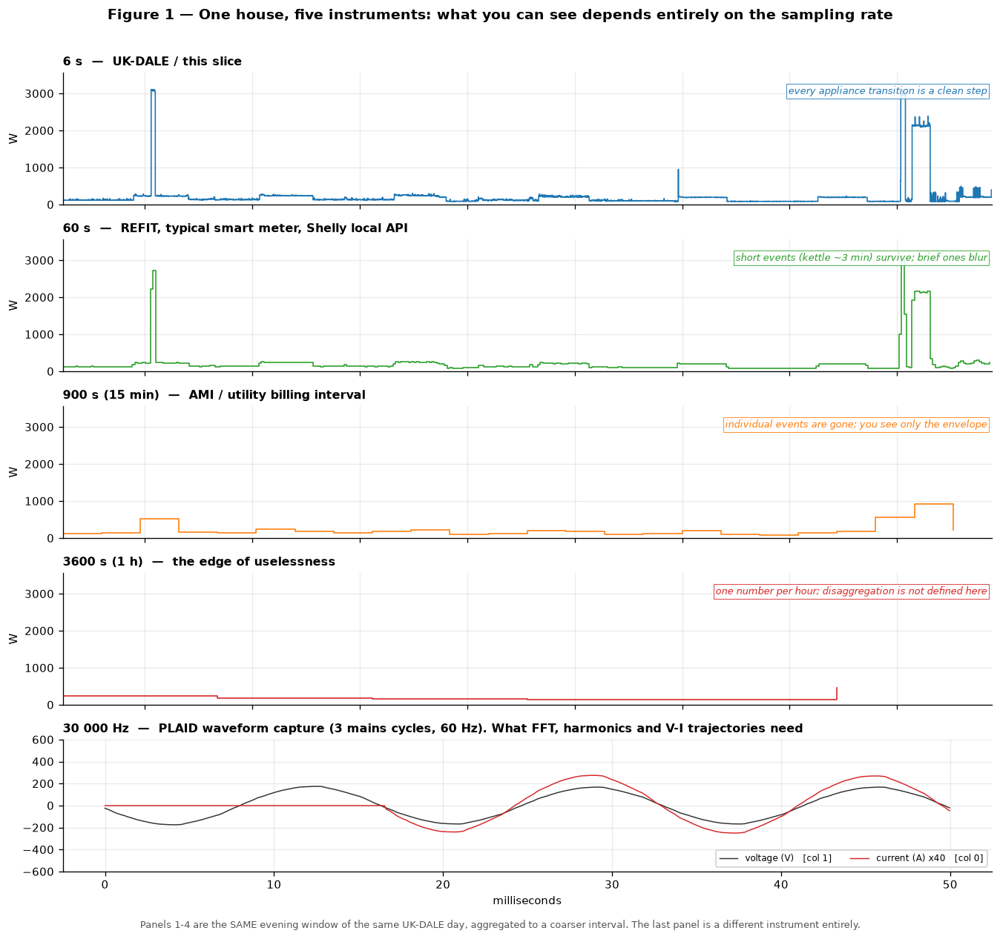
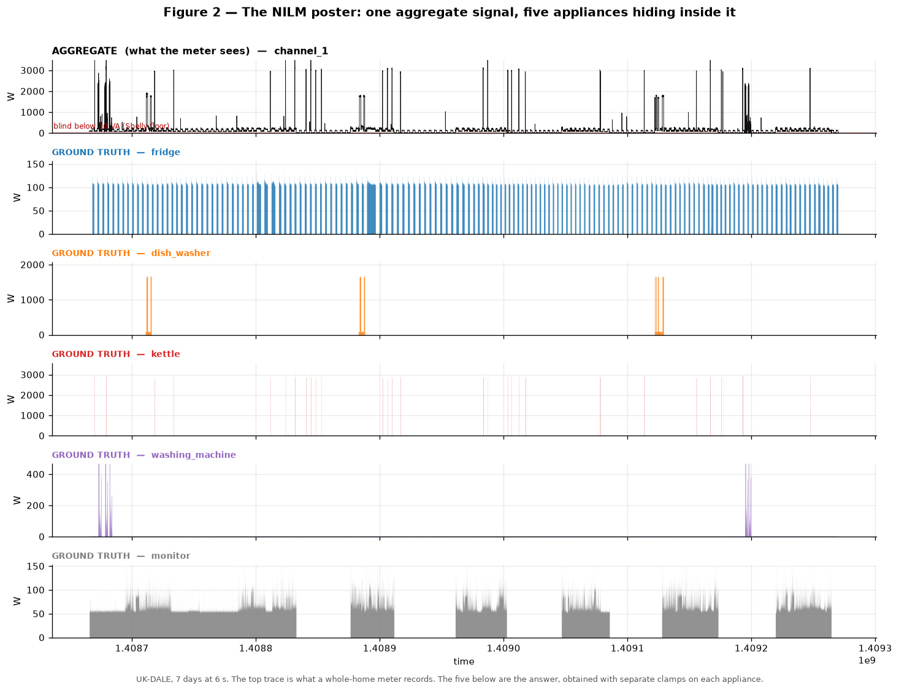
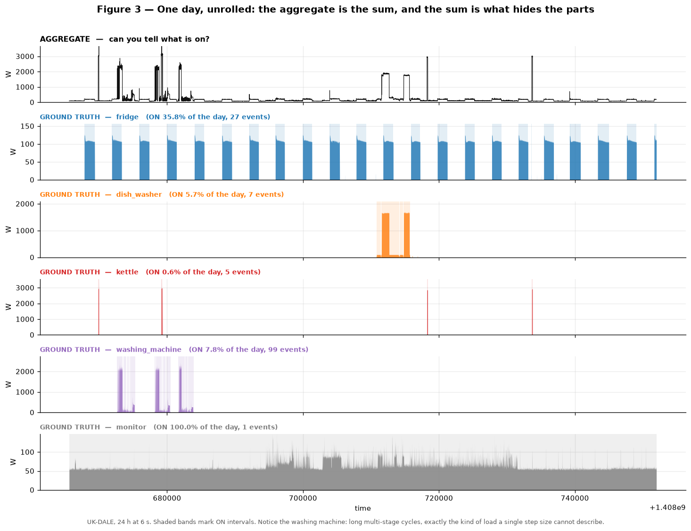
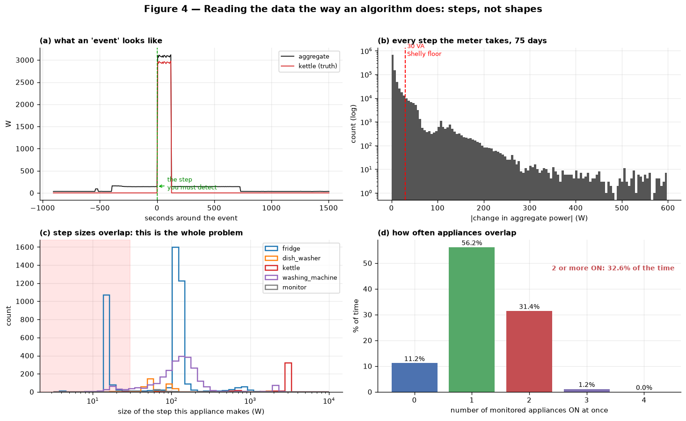
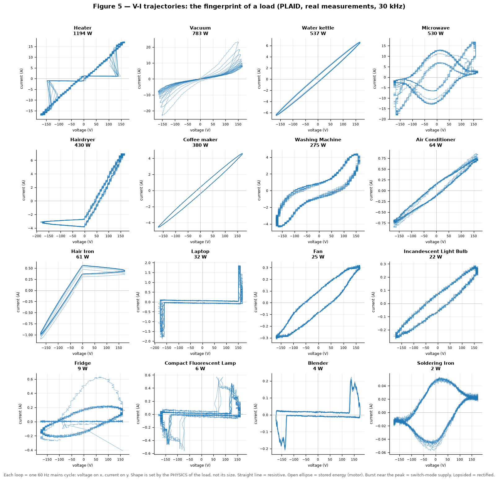
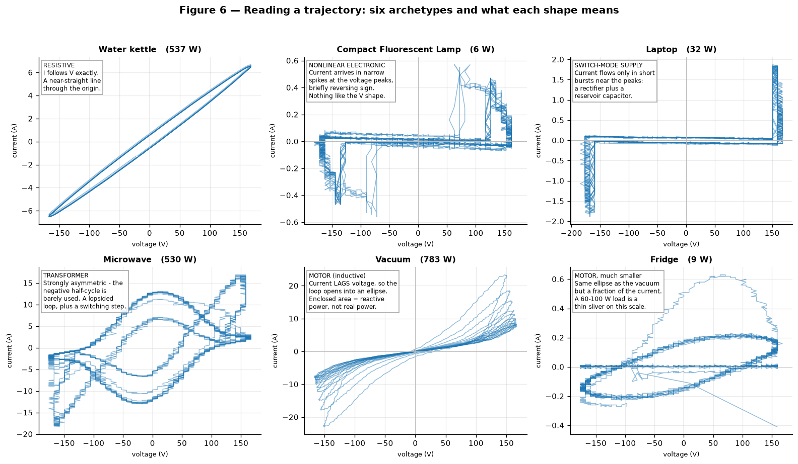
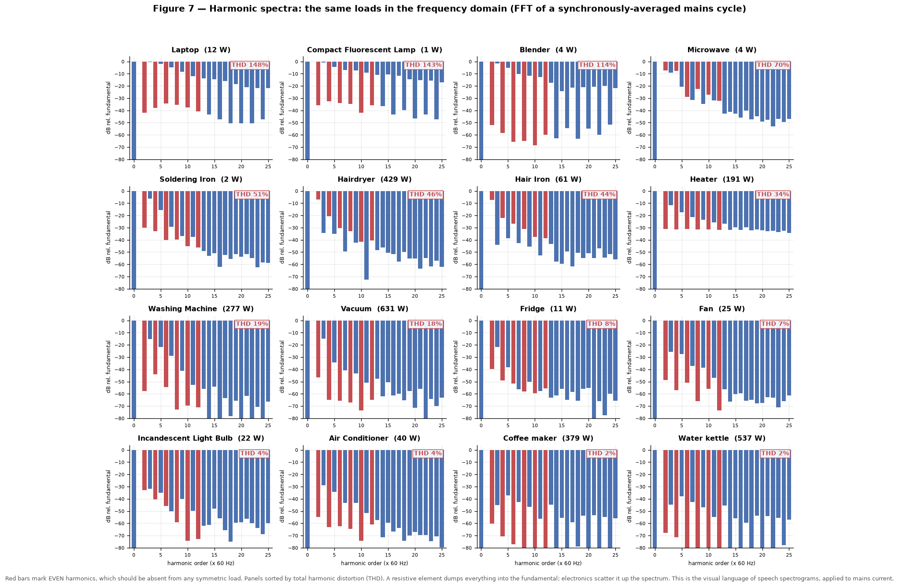
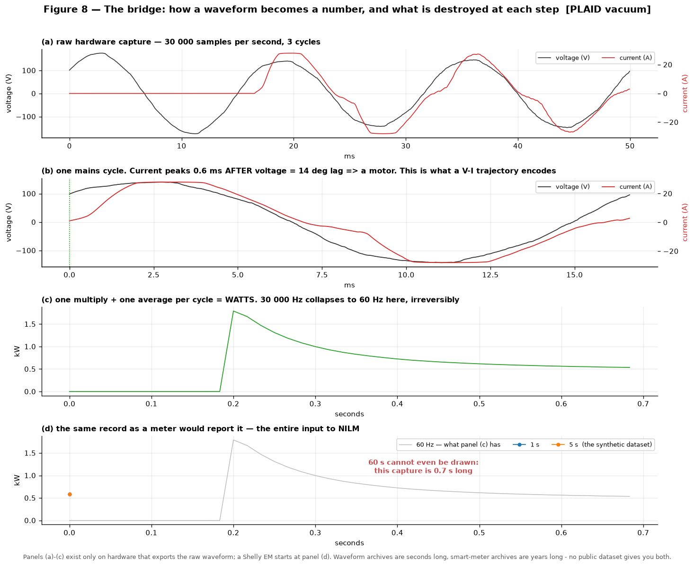
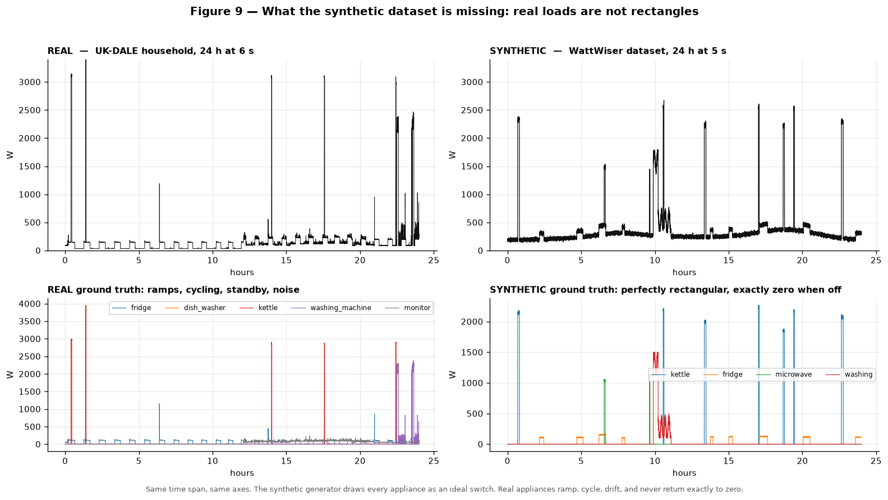

# Reading NILM Data — A Visual Masterclass

**Context:** Written for a reader whose signal-processing intuition comes from speech: spectrograms, mel images, treating audio as computer vision. The question was whether the same visual habits transfer to NILM, to Shelly data, and to V-I trajectories.

**Status:** Every figure below is generated from real measurements — UK-DALE 6 s ground truth (70.7 days, one UK home, 5 appliances) and 16 real PLAID waveform captures (30 kHz, 60 Hz mains, MIT). No synthetic signal appears except in Figure 9, where it is the subject.

**Read alongside:** `repo-review.md` (why the synthetic CSV in the client repo cannot support this work), `dataset-walkthrough.md` (what each public dataset contains), `projects/watt-wiser/research-logs/training-approaches.md` (how the literature attacks the problem these plots expose).

---

## 0. The short answer

Your instinct is right, and it transfers further than you would expect — but it transfers to a *different* primitive than you think.

| Your speech habit | Does it work in NILM? |
|---|---|
| Look at the waveform | Yes, but only if you have kHz hardware. The Shelly does not give you one. |
| Look at the spectrogram | Partly. Valid, rarely used, and it does not solve anything by itself. See §6. |
| Treat the 2D image as the input to a CNN | **Yes — and this is the dominant method in the field.** The V-I trajectory *is* a 2D image. See §5. |
| Separate a mixture into sources | Yes, but here the mixture is *exactly* the sum and you *know* the sources — and it is still hard. See §1. |
| Time-frequency is where the information lives | No. For NILM the information is in **shape**, not in time-frequency. See §1. |

The three sentences worth remembering:

1. **NILM's information is in the shape of the current, not in the frequency content of the power.**
2. **The V-I trajectory is the field's answer to "can I look at power like an image?" — and the answer is yes.**
3. **The Shelly EM Gen3 gives you neither the waveform nor the trajectory. It gives you one number per interval, which is the reddest panel in Figure 1.**

---

## 1. Your speech intuition, audited

### What transfers

**The habit of plotting before theorising.** Correct and rare. Most people in this space go straight to a model. The plots below are how you find out that a dataset is fake (§8) or that an appliance is unlearnable.

**Thinking in 2D.** This is the big one. In speech you eventually stopped looking at waveforms and started looking at spectrogram images. In NILM the equivalent move is the **V-I trajectory**: plot voltage on x, current on y, one loop per mains cycle. It is a closed 2D curve whose *shape* is fixed by the physics of the load. Papers feed these to CNNs. Your CV instinct is directly applicable here — see §5.

**Distrust of the aggregate.** In speech you never work on the raw mixture. Same discipline applies: the whole-house signal is a mixture and should be treated as one.

### What does *not* transfer

**Linearity.** This is the deepest difference and it is worth sitting with.

In speech, the mixture is not a clean sum — sources interact, the room convolves, and crucially **you do not know the sources**. Blind source separation is hard because it is blind.

In NILM the situation is the opposite in every respect:

```
P_total(t) = P_kettle(t) + P_fridge(t) + P_dishwasher(t) + ... + P_unknown(t)
```

That equation is **exact**. It is not an approximation. And you usually *know* which appliances exist, because you installed a clamp on each one to build the ground truth.

And it is still unsolved. This is the fact that surprises everyone who arrives from another signal domain. The field's own name for it, in an IEEE Transactions on Smart Grid paper, is **"NILM is unidentifiable"**. Not "hard". Unidentifiable.

The reason is that the inverse problem has no unique solution: two different appliances can produce the same aggregate step, and a single appliance can produce many different steps depending on its state. More information does not fix this — *different* information does. That is what §5 and §6 are about.

**Phase is information, not an artefact.** In speech you throw away phase because the ear barely uses it, so magnitude spectrograms are fine. In power, the phase relationship between voltage and current *is* one of the most discriminative quantities there is: it is the difference between a resistive heater (in phase) and a motor (lagging). Discard it and you have thrown away the feature. Figures 5 and 6 are entirely about phase.

**Timescales.** Phonemes last tens of milliseconds and a spectrogram frame is ~25 ms. An appliance state lasts **minutes to hours**. The interesting events are sparse — see the event statistics in Figure 4. You are not looking at a dense, quasi-stationary signal. You are looking at a mostly-flat signal punctuated by rare steps.

**"Noise" means something different.** In speech, noise is additive and uninteresting. In NILM, the "noise" is *other appliances* — structured, sparse, and exactly the thing you are trying to find. Do not filter it out.

### The one-line translation

> Speech: a dense, quasi-stationary, non-linear mixture whose sources are unknown, analysed in time-frequency.
> NILM: a sparse, piecewise-constant, exactly-linear sum whose sources are known, analysed in **shape** and **phase**.

---

## 2. Figure 1 — The ladder: what you can see depends on the instrument



Panels 1–4 are the **same evening window of the same house**, aggregated to coarser and coarser intervals. Read them top to bottom and watch information die.

| Panel | Rate | What survives | Where you meet it |
|---|---|---|---|
| 1 | 6 s | Every transition is a clean step. Kettle spikes to 3.1 kW, washing machine cycles, fridge pulses. | UK-DALE, this slice, REDD |
| 2 | 60 s | The kettle (a ~3 min event) still survives as a spike. Brief events blur into their neighbours. | REFIT, ENERTALK, the Shelly's stock history API (300 s at finest) |
| 3 | 900 s | Individual events are **gone**. You see the envelope of activity and nothing else. | Utility AMI / billing interval, most "smart meter data" |
| 4 | 3600 s | One number per hour. Disaggregation is not defined at this resolution. | Billing |

**How to read this.** The staircase shape is the signature of a piecewise-constant signal. Every vertical edge is an appliance switching. At 6 s you can count the edges; at 60 s you can see that something happened; at 900 s you can only see that the evening was busier than the afternoon.

The bottom panel is a different instrument: a real 30 kHz capture of a kettle. Notice that the **current (red) and voltage (black) cross zero together** — they are in phase. That single visual fact is the definition of a resistive load, and it is invisible in every panel above it.

**The lesson for your project.** Sampling rate is not a detail to confirm later. It is the variable that determines which of these five pictures you are even allowed to draw. The brief's §1 lists it as the first thing to confirm, which is correct — but the calibration document never names a sample rate anywhere, and nobody has yet confirmed what the Shelly will actually sustain. Those two facts are in tension, and the tension is the project.

To be precise about the hardware, because this matters and is easy to overstate: the Shelly's **stock history API** (`EMData.GetData`) accepts only `300`, `900`, `1800` and `3600`-second periods — five minutes at finest. That is for stored history, not for live polling. Real-time power *is* available from the local status endpoint and over MQTT, and if you flash ESPHome the `ade7953` component exposes a configurable `update_interval` that defaults to 60 s. So the question is not "can it report faster than 300 s" but "what rate does it reliably sustain, and what does the ADE7953's own integration time do to a step edge". That is an experiment, not a datasheet lookup, and it is the cheapest high-value experiment in the whole project.

---

## 3. Figures 2 and 3 — The poster, and one day unrolled



This is the canonical NILM picture. The top trace is the only thing a meter records. The five below are the answer, obtained with separate clamps on each appliance.

**What to notice:**

- The **fridge** pulses roughly every 50 minutes at ~107 W. Look at the regularity — that is a compressor duty cycle, and it is the closest thing in a house to a clock.
- The **kettle** appears as isolated spikes of ~2.9 kW. High power, low frequency, trivially detectable.
- The **monitor** is on around the clock at 50–60 W with heavy variation. It is the kind of load that hides under a threshold.
- The red band at the bottom of the top trace is the **30 VA blind spot** of the Shelly EM Gen3. Everything below that line is invisible to the hardware the project intends to use. Now look at the monitor trace and the fridge trace and ask how much of them survives.

That red band is the single most important annotation in this document. Your project's entire feasibility question lives in the gap between the aggregate trace and that band.



Same data, 24 hours. Shaded bands mark ON intervals and the title of each panel gives the duty cycle and the event count.

**How to read a day:**

- The **aggregate** is unreadable by eye. You can see that *something* happened between about 4 a.m. and 10 a.m. and again around hour 13, but not what.
- The **kettle** turns on 5 times. Each on-time is ~100 s. That is your easiest possible target.
- The **washing machine** is the instructive one: three long multi-stage cycles that day, each with a ramp, a plateau, and a slow decay. A disaggregator that thinks in single step sizes cannot represent it. Neither can a synthetic generator that draws rectangles — compare Figure 9.
- Duty cycles matter more than peak power. The fridge is on 36% of the day and the kettle 0.6%. A model that is 99% accurate can be 99% accurate by saying "everything is off".

---

## 4. Figure 4 — Reading events, not shapes



This figure shows the view that algorithms actually use. If you take one thing from this masterclass about low-frequency NILM, take this.

**Panel (a) — what an event is.** The aggregate rises by a step and the kettle trace rises by the same step. NILM at low frequency is *step detection plus step attribution*. Not spectral analysis. Not filtering.

**Panel (b) — every step the meter takes, over 70 days.** Note the log scale: most steps are tiny (aggregate noise and small loads), and the distribution has structure at ~107 W (fridge), ~330 W, ~700 W and ~2.9 kW (kettle). The red line at 30 W is the Shelly blind spot. Everything to its left is invisible to your hardware.

**Panel (c) — the whole problem in one plot.** This is the step size each appliance makes. Look at the x-axis: it is logarithmic, and the distributions **overlap heavily**. The fridge makes steps at 13 W *and* 107 W. The washing machine spreads from 20 W to 2 kW. The kettle makes steps at ~700 W and ~2.9 kW. There is no threshold that separates them. A 107 W step could be the fridge door closing or the washing machine advancing a stage — and you cannot tell from the step size alone.

**Panel (d) — simultaneity.** Appliances are on two or more at a time **32.6% of the time**. This is why single-appliance classification fails: a third of your events are combinations, not single loads.

**How to use this figure when reading a new dataset.** Compute (b), (c) and (d) before you build anything. If (c) shows separated modes, the problem is easy and a threshold will do. If it shows overlap, you need shape information — which means you need §5 or §6, and possibly hardware you do not have.

---

## 5. Figures 5 and 6 — The 2D view: V-I trajectories



**This is the answer to your question about treating signal data as images.** Sixteen real appliances, voltage on x, current on y, one loop per mains cycle. Twelve cycles overlaid per panel.

Nothing about this is a metaphor. These are 2D shapes, produced by a deterministic physical process, and they are the basis of the highest-performing high-frequency NILM methods (the canonical reference is doi:10.1109/tsg.2018.2888581 — 251 citations). People literally rasterise these and feed them to CNNs. Your spectrogram-as-image habit applies here directly.

**The four shape archetypes — learn these and you can read any trajectory:**

| Shape | Physics | Examples in the figure |
|---|---|---|
| **Straight line through the origin** | Purely resistive: current is proportional to voltage at every instant. | Water kettle, coffee maker, incandescent bulb, air conditioner |
| **Open ellipse / loop** | Inductive: current lags voltage because the load stores energy in a magnetic field. **The area inside the loop is reactive power** — power that does no work. | Vacuum, fan, fridge, washing machine |
| **Burst near the voltage peak** | Switch-mode supply: a rectifier charges a capacitor, so current only flows when the instantaneous voltage exceeds the capacitor voltage. | Laptop, CFL |
| **Asymmetric / lopsided** | Half-wave rectification or a transformer under asymmetric load: the negative half-cycle is treated differently from the positive. | Microwave, hairdryer |



Figure 6 enlarges six archetypes with the reading next to each. Work through them left to right, top to bottom.

**The three things to look for, in order:**

1. **Where does the loop cross the axes?** A line through the origin = resistive. A loop that opens = energy storage. A loop that only opens on one side = rectification.
2. **How thick is the curve?** A thin curve means the load is stable cycle to cycle. A thick, fuzzy curve means the load is variable (a motor with changing torque, or a noisy capture) and will be harder to classify. Compare the razor-thin kettle line with the smeared fan loop.
3. **Does the shape stay the same at low current?** The *shape* is scale-invariant, which is exactly why it works: a 100 W and a 2000 W variant of the same appliance family will produce a similar trajectory, just smaller. **This is the property that step size does not have.** Figure 4(c) showed you that step sizes overlap hopelessly; the trajectory shapes do not.

**A caveat you must know.** PLAID — the public dataset all of this comes from — has known calibration problems. Notice that in Figure 8 the vacuum current looks clipped at ±28 A: the current transformer saturated. Several PLAID captures (a fridge and a fan among mine) have voltage spikes exceeding 300 V, which is not physical. When you use PLAID, check the voltage range before trusting a trajectory. This is a real limitation of the dataset, not of the method.

**Why this works when the spectrogram does not.** This is the subtle part, and it is the technical heart of your question.

A spectrogram is a **linear** transform. That means:

```
spectrogram(kettle + fridge) = spectrogram(kettle) + spectrogram(fridge)
```

So moving to the spectrogram domain does not separate anything. It restates the mixture in a different basis and leaves the underdetermination exactly where it was. This is the same reason a Fourier transform of the aggregate power signal tells you nothing new.

A V-I trajectory is a **non-linear** transform: it plots `i` against `v` pointwise, so it depends on the *joint* distribution of voltage and current, not on their marginal spectra. Two appliances whose power spectra look similar can have completely different trajectories, because the trajectory encodes the phase and shape relationship that the power spectrum discards. **That is the whole reason the field abandoned spectral methods for this one.**

---

## 6. Figure 7 — The frequency view, done properly



You asked specifically whether people use FFT on electrical signals the way they do on speech. Here is the honest answer, with pictures.

**Yes, this is a real technique.** It is called harmonic analysis. You take one mains cycle of current and FFT it. Because the window is *exactly* one period, it is perfectly periodic and spectral leakage vanishes — no windowing function needed. The bins land on 60 Hz, 120 Hz, 180 Hz, ... (50 Hz in Europe, which is what Vietnamese mains is).

**How to read it.** The fundamental (order 1) is normalised to 0 dB. Every other bar shows how much energy that harmonic carries *relative to the fundamental*. Panels are sorted by total harmonic distortion (THD).

- **Water kettle, 2% THD.** Essentially all energy in the fundamental — its tallest harmonic sits 38 dB below the fundamental. This is a pure resistor. Its spectrum is a single spike and therefore carries almost no identity — it is the same spike any resistor would produce.
- **Laptop, 148% THD.** Harmonics as strong as the fundamental. This is a switch-mode supply, and its harmonic fingerprint is distinctive.
- **Red bars mark even harmonics (2nd, 4th, 6th...).** In a symmetric load, even harmonics should be **absent** — a load that treats both half-cycles identically cannot generate them. When they appear, it means half-wave rectification. The CFL, laptop, blender and heater show them; the kettle and coffee maker do not.

**What I did to make this readable, and why it matters.** My first attempt used a single raw cycle and the result was broadband mush — because PLAID's captures are *transition* captures, so most cycles are in the wrong state. The fix is **synchronous averaging**: find the rising zero-crossing of the voltage in each cycle, rotate the cycle so they all align, then average across many cycles. Noise averages down, the periodic part survives.

That is worth remembering as a technique in its own right — it is how you extract a clean signature from a noisy capture. If you have a Shelly or any synchronised capture, this is the operation you would run.

**But here is why it does not solve NILM.** Three reasons, in increasing order of importance:

1. **The fundamental carries no identity.** Its amplitude is just the power. All the discriminative information is in the small harmonics, which are 20–60 dB down and therefore the first thing destroyed by noise or a low-resolution ADC.
2. **The FFT is linear.** `FFT(kettle + fridge) = FFT(kettle) + FFT(fridge)`. Same problem as the spectrogram: a change of basis, not a separation. Harmonics help you *classify* an already-isolated load; they do not help you *isolate* it from the aggregate.
3. **The Shelly cannot produce this at all.** The ADE7953 metering chip exposes scalar registers — RMS current, RMS voltage, active power. There is no waveform register in the ESPHome driver or in the stock firmware. No waveform means no harmonics, no V-I trajectory, and no spectrogram. **This is the binding constraint on the entire project, and it is the reason §5 and §6 are interesting in the abstract but unavailable in practice.**

---

## 7. Figure 8 — The bridge: waveform to number



This figure shows exactly what is destroyed, and where, as raw samples become the single number that NILM consumes. It is the most direct answer to "what can I actually see with the hardware I have?"

| Panel | Available at | Contains |
|---|---|---|
| (a) raw waveform, 30 kHz | Only with waveform-exporting hardware | Everything: phase, harmonics, transients, inrush |
| (b) one cycle | Same | The phase relationship, explicitly. This is the inrush cycle — the clamp is flat-topping the current at 28 A — but the zero-crossings still show it: the current crosses zero ~0.9 ms (~20° at 60 Hz) behind the voltage, and once the motor is running the lag collapses to ~0.05 ms. A universal motor is mostly a resistive path; its signature here is the inrush and the rippled current shape, not a big steady-state phase shift. |
| (c) watts at 60 Hz | Same, after one multiply and one average | The power signal *before* any downsampling. Note the vacuum's **inrush**: it spikes to 1.79 kW and decays to a 0.55 kW plateau over half a second. |
| (d) 1 s and 5 s | Any meter, including the Shelly | The inrush is now two or three points. |

**The annotation in panel (d) is the point of the figure.** 60 s cannot be drawn at all, because this capture is only 0.7 s long. That is not a quirk of the dataset — it is structural:

> **Waveform archives are seconds to minutes long. Smart-meter archives are months to years long. No public dataset gives you both at once.**

That is why the literature splits into high-frequency and low-frequency camps, why V-I trajectory papers never use REFIT, and why the "I'll use the Shelly and also do V-I trajectories" plan is not achievable with one device. You would need the Shelly for duration and a separate high-rate logger for shape.

**Shelly blind spot summary.** From `repo-review.md` §11 and the hardware work: a 30 VA no-load threshold per channel, ±5% accuracy only above ~230 W, and a calibration routine whose own documentation says the minimum power allowed is 500 W. Its stock history API stores at 300 s; live polling and a flashed ESPHome build are faster in principle but unverified in practice. The relevant columns from the brief are the ones that matter here, and this figure tells you where they land in the data.

---

## 8. Figure 9 — Real vs synthetic



Same time span, same axes, two datasets. This one exists to be looked at side by side.

**Top row.** Both aggregates look plausible. Both are piecewise-constant staircases. If you only saw these two plots you would not be able to tell which is real. **Visual plausibility is not a validity test** — this is the lesson.

**Bottom row.** The ground truth gives it away immediately:

- **Real**: the kettle ramps on and off; the washing machine shows a multi-stage ramp with a plateau; the monitor is noisy and never returns exactly to zero; the fridge cycles continuously.
- **Synthetic**: every appliance is a **perfect rectangle**. Exactly zero when off. Exactly constant when on. Washing machine capped at exactly 1500.0 W across the whole month.

**The diagnostic tests, if you want them quantified** (all reproducible via `deprecated/analysis/repo-forensics/analyze_synthetic.py`):

| Test | Real data behaves | The synthetic CSV behaves |
|---|---|---|
| Appliance power when OFF | 0 W plus noise | **exactly 0.00 W on all 518,400 rows** |
| `frequency_Hz` | drifts around 50 Hz (49.9–50.1) | **white noise**, lag-1 autocorrelation −0.001 |
| `voltage_V` | varies with load, sags on big loads | **deterministic daily sine**, kurtosis −1.110 |
| Voltage under heavy load | sags | **no sag at all** (correlation −0.079) |
| Simultaneous appliances | 32.0% of the time (UK-DALE) | **1.71%** |
| Unlabelled loads | always present in a real home | **none** |
| Internal consistency | — | **exact to 3 decimal places** (it validates against itself) |

That last row is the reason `validate_data.py` can never fail: it computes apparent power from V×I and compares it to the apparent-power column, which the generator produced from V×I. It is checking the generator against itself.

**Why this matters for the project.** The brief's §1 states that data will be synthesised with gen AI while the product side is built. Figure 9 is why that substitution fails: the synthetic data has none of the properties that make NILM hard. A model trained on it will learn to detect rectangles, will score near-perfectly, and will encounter nothing it recognises on the first real Shelly.

---

## 9. How to look at a new NILM dataset in ten minutes

A checklist. Run these in order; stop when something fails.

1. **Plot one day of the aggregate.** Staircase or smooth? If smooth, note the sampling rate — you are probably at the wrong resolution to do anything.
2. **Plot the per-appliance ground truth underneath it, same axis.** Is the aggregate visibly the sum? If the aggregate is *exactly* the sum with zero residual, you may be looking at a generated file — a real home meter sees 40+ unmonitored loads.
3. **Compute the appliance ON-fractions.** Anything below ~1% is a class-imbalance problem. Anything above ~50% is nearly always-on.
4. **Compute the |ΔP| histogram of the aggregate (Figure 4b).** Where is the 30 W wall? How much mass is beneath it?
5. **Compute per-appliance step-size distributions on a log axis (Figure 4c).** Do the modes overlap? If yes, thresholds are dead and you need shape.
6. **Compute simultaneity (Figure 4d).** If 2+ appliances are on more than ~20% of the time, single-label classification is not enough.
7. **Check `frequency`, `voltage`, and `power_factor` for physical realism.** Autocorrelation and kurtosis catch generated data fast — a real mains frequency wanders; a generated one is white noise.
8. **Look for voltage sag under load.** Real mains sags. Generators forget.
9. **Only now, attempt a trivial threshold baseline** and report the over-detection ratio per appliance. This tells you what the ceiling for a naive method is.
10. **Write down the sampling rate, the duration, the number of homes, and the number of appliances before you write any model.** If any of those is unknown, you do not yet have a dataset.

---

## 10. What this means for WattWiser

Mapping the four visual primitives onto the project's actual hardware:

| Primitive | Needs | Shelly EM Gen3 gives it? |
|---|---|---|
| Power time series (Fig 1–3) | Any rate | **Partly** — scalar power is available; stored history is 300 s, live polling is faster but unverified |
| Event / step view (Fig 4) | ~1–10 s | **Unknown — this is the experiment to run.** 300 s destroys every step; a sustained 1–5 s live rate would preserve them |
| V-I trajectory (Fig 5–6) | Raw waveform, ≥10 kHz | **No** — no waveform register exists |
| Harmonic spectrum (Fig 7) | Raw waveform, ≥10 kHz, phase-synchronised | **No** — same reason |

So the visual vocabulary of this document divides cleanly in two. Figures 1–4 and 8(d) describe the world the project can reach. Figures 5–7 describe the world the project cannot reach with a Shelly, however good the model is.

That is not a reason to abandon the project. It is a reason to state the target precisely: **2–4 large, distinct, mostly binary appliances, with household-specific calibration and an explicit UNKNOWN state, at whatever rate the hardware actually sustains.** That is feasible. Whole-home coverage including standby loads is not, and the 30 VA wall in Figure 2 is why.

---

## Appendix — reproduction

All figures regenerate from the scripts in this repository. The data they need:

- `projects/watt-wiser/research-logs/sakunrasilka_nilm-test2/` — UK-DALE slice (5 channels + custom aggregate), 6 s, 70.7 days. Provenance corrected 2026-09-21: house-5 channels under house_1-style labels, synthetic aggregate - see `docs/datasets/dataset-walkthrough.md` section 8.
- `research-logs/vi/plaid_samples/` — 16 PLAID waveform captures, 30 kHz, extracted by HTTP range request from the Figshare archive. Regeneration script: `research-logs/vi/plaid_fetch.py`.
- `repo/WattWiser/data/raw/synthetic_shelly_data.csv` — the synthetic dataset from the client repo, used only in Figure 9.

Figure generation scripts live in `figures/src/`, one script per figure: `fig01_resolution_ladder.py` through `fig09_real_vs_synthetic.py`, plus the shared `_figcommon.py` boot module. Note that the PLAID captures are *transition* captures: the load may be OFF for most of the file. The metadata's `status` field (`off-on` / `on-off`) must be used to select the live portion, or you will FFT the standby state.

Environment: uv-managed deps (`uv sync`, run with `uv run python3`), matplotlib with `Agg` and `MPLCONFIGDIR=/tmp/mplcfg`.
